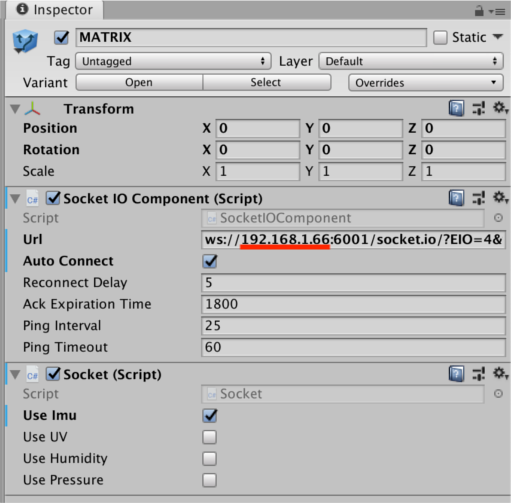

# matrix-lite-js-unity
A guide on interacting with unity &amp; MATRIX Lite over wifi.

# Setup

### 1. Install MATRIX Lite JS
Your Raspberry Pi will act as a server and send sensor data by utilizing the socket.io & matrix-lite-js npm modules.
[Installation Steps](https://matrix-io.github.io/matrix-documentation/matrix-lite/overview/)

### 2. Download Unity
Download and launch Unity on your personal computer. Unity supports Windows, Mac, and Linux.

[Download](https://store.unity.com/download?ref=personal)

### 3. Setup The Raspberry Pi Server
Install git to clone this repository on your Raspberry Pi.
```
sudo apt-get install git
```

Once installed, clone this repo and run the script inside the server folder.
```
git clone https://github.com/matrix-io/matrix-creator-sensors-unity/
cd matrix-creator-sensors-unity/server
npm install
node index.js
```

### 4. Setup The Unity Client
With your Raspberry Pi ready, you should now manually download this repository to your personal computer and extract the `client.unitypackage` file into Unity. This contains all the scenes and assets you'll need.

The scenes in the example folders contain a basic example of how to interact with the IMU of your MATRIX Creator. Keep in mind, you'll need to edit the `MATRIX` game object to point to the IP address of your Raspberry Pi. Aside from the IP address, do not edit anything else from the URL.



### 5. Good To Go
With the Unity example pointing to your Raspberry Pi, you can run the example and move your MATRIX around to see the IMU sensor in action.

# Usage
The MATRIX Prefab in `client.unitypackage` can be dropped into any scene to connect to your MATRIX Creator. Assuming the IP address is set correctly and the sensor you want is selected from the checkbox.

Below are the command you can use in your C# scripts to read each sensor.
```c#
Matrix.Imu.yaw
Matrix.Imu.pitch
Matrix.Imu.roll
Matrix.Imu.accelX
Matrix.Imu.accelY
Matrix.Imu.accelZ
Matrix.Imu.gyroX
Matrix.Imu.gyroY
Matrix.Imu.gyroZ
Matrix.Imu.magX
Matrix.Imu.magY
Matrix.Imu.magZ

Matrix.UV.value

Matrix.Pressure.pressure
Matrix.Pressure.altitude
Matrix.Pressure.temperature

Matrix.Humidity.humidity
Matrix.Humidity.temperature
```
